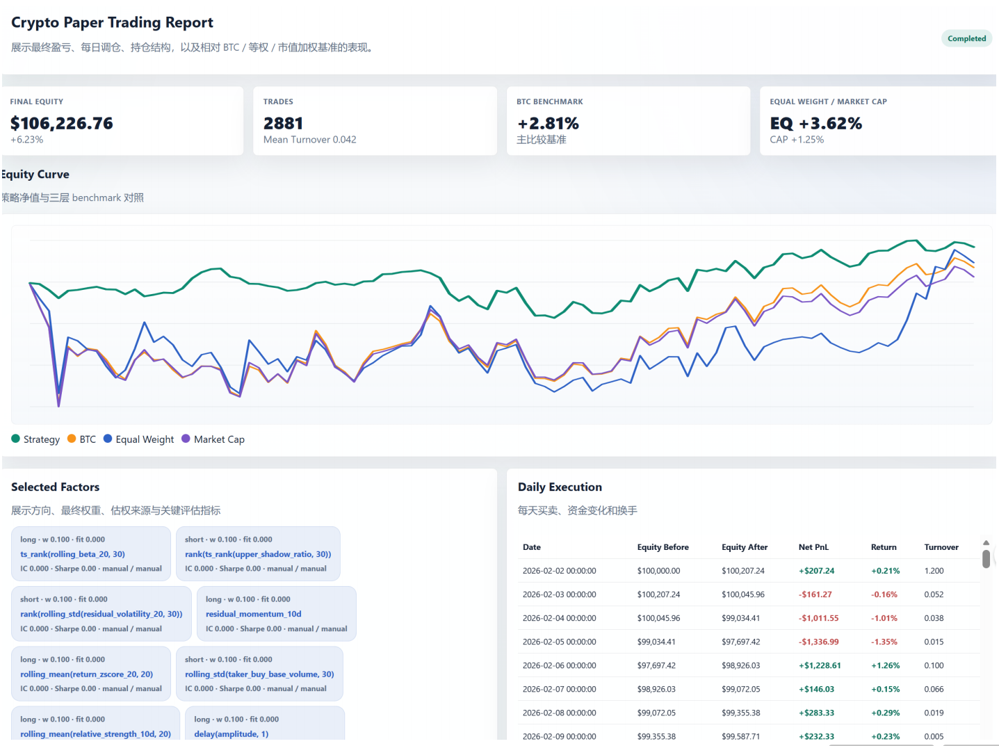

# Crypto Alpha Mining System

A Python-based crypto research repository for alpha discovery, offline backtesting, and local paper-trading experiments.

## What This Repository Covers

This repository is organized around three separate stages of the quant workflow:

1. Research system
   - Builds features from local crypto panel data.
   - Generates and evaluates candidate alpha factors.
   - Selects a final factor set using a fixed research window.
2. Backtest system
   - Runs an isolated final backtest after factor selection.
   - Produces summary metrics and markdown/JSON reports.
   - Is intended for reproducible offline evaluation, not live execution.
3. Paper-trading system
   - Exposes a local dashboard for submitting factor definitions.
   - Simulates post-backtest paper trading on later dates.
   - Is for local experimentation only and does not place real orders.

These stages are intentionally separated. Research and factor selection happen first, the final backtest is run on a later holdout window, and paper trading should begin only after the backtest window ends.

## Repository Layout

```text
.
|-- alpha_mining/        # Research pipeline, factor generation, validation, selection, dashboard entrypoints
|-- backtest/            # Backtest engine, strategy logic, reporting helpers
|-- crypto_data/         # Versioned local crypto dataset used by the workflow
|   `-- binance_crypto30_daily/
|       |-- panel.csv
|       |-- universe.csv
|       |-- benchmark.csv
|       |-- market_cap_benchmark.csv
|       |-- equal_weight_benchmark.csv
|       `-- metadata.json
|-- data_crypto/         # Data loading and exchange download helpers
|-- execution_crypto/    # Local paper-trading execution logic
|-- features_crypto/     # Feature engineering
|-- reports/             # Generated outputs (ignored by Git)
|-- ui_crypto/           # Static assets for the local dashboard
|-- universes/           # Universe definitions
|-- utils/               # Shared utilities for config, plots, and I/O
|-- main.py              # Thin launcher for alpha_mining.run_crypto_workflow
|-- requirements.txt     # Python dependencies
`-- README.md
```

## Versioned Data vs Local-Only Data

Committed to GitHub:

- Source code under `alpha_mining/`, `backtest/`, `data_crypto/`, `execution_crypto/`, `features_crypto/`, `ui_crypto/`, `universes/`, and `utils/`
- Reproducible sample dataset under `crypto_data/binance_crypto30_daily/`
- Root project files such as `README.md`, `requirements.txt`, `main.py`, and `.gitignore`

Kept local only and ignored by Git:

- Generated outputs under `reports/` and `outputs/`
- Local registries such as `alpha_mining_registry/`
- Virtual environments, caches, logs, scratch files, and editor-specific files
- Any temporary CSV/JSON artifacts created during ad hoc experiments

## Linux Quick Start

Run everything from the repository root.

### 1. Clone the repository

```bash
git clone https://github.com/TZTHandsome/quant-systems.git
cd quant-systems
```

If your GitHub repository name is different, replace `quant-systems` with the actual name.

### 2. Create a virtual environment

```bash
python3 -m venv .venv
source .venv/bin/activate
python -m pip install --upgrade pip
python -m pip install -r requirements.txt
```

### 3. Run the full research plus final backtest workflow

```bash
python -m alpha_mining.run_crypto_workflow \
  --panel-csv crypto_data/binance_crypto30_daily/panel.csv \
  --universe-csv crypto_data/binance_crypto30_daily/universe.csv \
  --btc-benchmark-csv crypto_data/binance_crypto30_daily/benchmark.csv \
  --market-cap-benchmark-csv crypto_data/binance_crypto30_daily/market_cap_benchmark.csv \
  --output-dir reports/repro_run \
  --initial-capital 100000 \
  --seed 42
```

This is the main reproducible workflow. It loads local data, engineers features, mines candidate factors, validates them on the research window, selects final factors, and then runs the final holdout backtest.

### 4. Inspect the generated outputs

Important outputs are written under the chosen `--output-dir`:

- `workflow_report.md`
- `selected_factors_summary.csv`
- `backtest/backtest_report.md`
- `backtest/backtest_metrics.json`

## Minimal Reproducible Workflow

The intended reproducible setup is:

- Same code revision
- Same files under `crypto_data/binance_crypto30_daily/`
- Same Python dependency versions
- Same CLI arguments, especially `--seed`

If those inputs remain unchanged, the workflow should be reproducible at the report level.

## Research, Backtest, and Paper-Trading Boundaries

Research window:

- `2024-01-01` to `2024-12-31`

Final backtest window:

- `2025-06-01` to `2026-01-31`

Paper-trading guidance:

- Start after the final backtest ends.
- A safe default is `2026-02-01` or later.
- With the current local dataset, a practical paper window is `2026-02-12` to `2026-05-12`.

This separation is important because the paper-trading stage should not overlap with the reported final backtest window.

## Run the Local Paper-Trading Dashboard

Start the dashboard server:

```bash
python -m alpha_mining.run_crypto_dashboard \
  --panel-csv crypto_data/binance_crypto30_daily/panel.csv \
  --universe-csv crypto_data/binance_crypto30_daily/universe.csv \
  --btc-benchmark-csv crypto_data/binance_crypto30_daily/benchmark.csv \
  --market-cap-benchmark-csv crypto_data/binance_crypto30_daily/market_cap_benchmark.csv \
  --output-dir reports/paper_dashboard_runs \
  --host 127.0.0.1 \
  --port 8050
```

Then open:

```text
http://127.0.0.1:8050
```

The dashboard is local-only and paper-only. It is meant for simulation and monitoring, not brokerage execution.

## Paper Trading Preview



This preview shows:

- the portfolio-level equity curve
- benchmark comparisons versus BTC, equal weight, and market-cap baselines
- selected factors, weights, and execution details

## Backtest Output Example

The workflow writes a research report and a final backtest report under the selected output directory.

Typical generated files:

- `reports/<run_name>/workflow_report.md`
- `reports/<run_name>/selected_factors_summary.csv`
- `reports/<run_name>/backtest/backtest_report.md`
- `reports/<run_name>/backtest/backtest_metrics.json`

Example summary format:

```text
Final equity:      $106,226.76
Total return:      +6.23%
Trades:            2881
Mean turnover:     0.042
BTC benchmark:     +2.81%
Equal weight:      +3.62%
Market cap:        +1.25%
```


## Factor Input Format for Paper Trading

Paste one factor per line into the dashboard input box.

- Use `long:` for positive direction.
- Use `short:` for negative direction.

Example:

```text
long: ts_rank(rolling_beta_20, 30)
short: rank(ts_rank(upper_shadow_ratio, 30))
short: rank(ts_rank(residual_volatility_20, 30))
long: residual_momentum_10d
```

If the dashboard weighting mode is `manual`, weights can be attached inline:

```text
long: ts_rank(rolling_beta_20, 30) | weight=13.021370923890153
short: rank(ts_rank(upper_shadow_ratio, 30)) | weight=11.114797037293057
```

## Entry Points

- `python main.py`
  - Thin launcher for the main workflow.
- `python -m alpha_mining.run_crypto_workflow`
  - Preferred explicit workflow entrypoint.
- `python -m alpha_mining.run_crypto_dashboard`
  - Local dashboard and paper-trading entrypoint.

## How To Customize

Other users can adapt the repository without changing the overall workflow structure.

Common customization points:

- Replace the local dataset under `crypto_data/binance_crypto30_daily/` with a different crypto panel.
- Adjust the trade universe through `crypto_data/binance_crypto30_daily/universe.csv` or files under `universes/`.
- Modify data ingestion logic in `data_crypto/`.
- Extend feature engineering in `features_crypto/engineer.py`.
- Change factor generation, validation, or selection logic in `alpha_mining/`.
- Adjust portfolio construction behavior in `alpha_mining/portfolio_construction.py`.
- Use a different `--output-dir` for each experiment run.
- Submit custom factor lists through the dashboard for paper-trading experiments.

Suggested workflow for new experiments:

1. Keep the committed dataset as a reproducible baseline.
2. Copy the workflow command and change only one dimension at a time, such as data, factor logic, or evaluation window.
3. Write results to a new `--output-dir`.
4. Compare the new report against previous runs instead of overwriting old outputs.

If you plan to support alternative datasets or longer-term extensions, it is a good idea to create separate subdirectories under `crypto_data/` and keep the original `binance_crypto30_daily/` folder as the baseline example.

## Notes

- Use a fresh `--output-dir` when comparing experiments.
- Keep generated reports out of version control.
- If you fetch new market history locally, avoid overwriting the committed reproducible dataset unless you intend to update the repository baseline.
